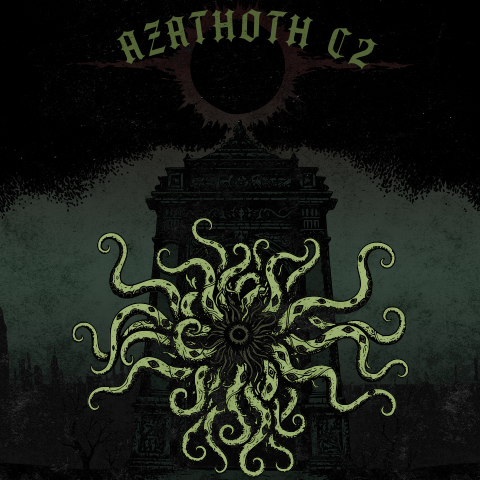

# Azathoth C2 project

> Ty [@otterpwn](https://github.com/otterpwn) for the logo!

This is the C2 I've been working on for the past few years, all stored in one neat Github organization so i don't get it confused with other projects.

## Project Structure

### Beacon
* [Beacon Transport Source code](https://github.com/AzathothC2/beacon-transports-src) (Private) Source code for the beacon transport libraries
* [Beacon Core Source code](https://github.com/AzathothC2/beacon-core-src) (Private) Source code for the core beacon library
* [Beacon Plugins Source code](https://github.com/AzathothC2/beacon-plugins-src) (Private) Source code for the basic beacon plugins

### Azathoth C2
* [Azathoh C2 Source code](https://github.com/AzathothC2/azathoth-c2-src) (Private) Source code for the C2 itself
* [Azathoth C2 Plugins Source code](https://github.com/AzathothC2/azathoth-plugins-src) (Private) Source code for the basic C2 plugins
* [Azathoth C2 Clients Source code](https://github.com/AzathothC2/azathoth-clients-src) (Private) Source code for the available C2 clients

### Global 
* [Core](https://github.com/AzathothC2/azathoth-core) Crate for basic structs and types
* [Utils](https://github.com/AzathothC2/azathoth-utils) Utility crate
* [Dynamic loader](https://github.com/AzathothC2/azathoth_libload) Dynamic library loader
* [Allocator](https://github.com/AzathothC2/azathoth_allocator) Project allocator
